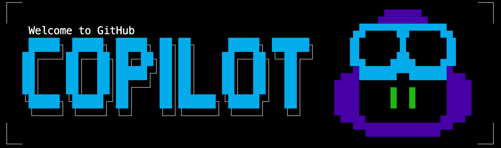

# GitHub Copilot CLI - 101



A practical, beginner-friendly learning path for GitHub Copilot CLI. This repository is designed for developers who want to understand how to use GitHub Copilot from the command line to speed up everyday development tasks.

---

## Who This Is For

This course is for developers who:

- Are new to GitHub Copilot CLI or have only used the editor extension
- Want to understand how to use AI assistance directly from the terminal
- Are comfortable with basic terminal usage and writing code in any language

No prior experience with AI tools is required. Basic familiarity with Git and the command line is expected.

---

## What You Will Learn

By working through this course, you will be able to:

- Install and configure GitHub Copilot CLI in your development environment
- Understand the different interaction modes and when to use each
- Use Copilot CLI to explain, review, and generate code from the terminal
- Apply Copilot CLI to real development workflows such as debugging, testing, and code review
- Create custom instructions to tailor Copilot's behavior to your project
- Submit evidence of your learning and earn a completion badge

---

## Prerequisites

Before starting, make sure you have the following:

| Requirement | Details |
|---|---|
| GitHub account | Free or paid at github.com |
| GitHub Copilot subscription | Individual, Business, or Enterprise plan |
| GitHub CLI (`gh`) | Version 2.x or later — install from cli.github.com |
| A code editor | Any editor works; VS Code recommended |
| Terminal access | macOS Terminal, Linux shell, or Windows WSL |

---

## Course Modules
Work through the modules in order. Each module builds on the previous one.

| Module | Topic | Description |
|---|---|---|
| [Module 01](./modules/01-getting-started/README.md) | Getting Started | Installation, authentication, and your first commands |
| [Module 02](./modules/02-core-commands/README.md) | Core Commands and Context | Essential commands, context management, and session handling |
| [Module 03](./modules/03-workflows/README.md) | Development Workflows | Code review, debugging, testing, and Git integration |
| [Module 04](./modules/04-advanced/README.md) | Custom Instructions and Agents | AGENTS.md, custom agents, and advanced configuration |

---

## How to Use This Repository

1. **Read each module** in the `modules/` directory, starting from Module 01.
2. **Follow along in your terminal** — each module includes commands and prompts you can try.
3. **Complete the exercises** at the end of each module before moving on.
4. **Finish the submission task** (described below) to earn your completion badge.

You do not need to fork this repository to follow along. All exercises can be done in your own terminal and any project you choose.

---

## Submission Task

After completing all four modules, submit evidence of your learning to receive a completion badge.

### What to Submit

You will need to capture **three screenshots** showing:

1. **GitHub Copilot CLI installed and working** — Run `gh copilot --version` and take a screenshot showing the output.
2. **An explain or suggest command in action** — Use `gh copilot explain` or `gh copilot suggest` on any command or code snippet and screenshot the result.
3. **A workflow you completed** — Screenshot any one of the development workflow exercises from Module 03 (code review, debugging session, test generation, or commit message generation).

### How to Submit

1. Open a new issue in this repository using the **Submission** issue template.
2. Add your three screenshots to the issue.
3. Write a brief note (2-3 sentences) about what you found most useful.
4. Submit the issue and wait for a review.

Once your submission is reviewed and accepted, a **completion badge** will be awarded.

---

## Repository Structure

```
github-copilot-cli-101/
├── README.md                  # You are here
├── LICENSE                    # MIT License
├── CODE_OF_CONDUCT.md         # Community guidelines
├── SUPPORT.md                 # Where to get help
├── images/
│   └── badge.png              # Completion badge (added by maintainer)
└── modules/
    ├── 01-getting-started/
    │   └── README.md
    ├── 02-core-commands/
    │   └── README.md
    ├── 03-workflows/
    │   └── README.md
    └── 04-advanced/
        └── README.md
```

---

## Getting Help

- If you are stuck on an exercise, open a Discussion and describe what you tried.
- If you find an error in the content, open an Issue with the label `content-error`.
- Read [SUPPORT.md](./SUPPORT.md) for additional help resources.

---

## Contributing

Contributions to improve this course are welcome. Please read [CODE_OF_CONDUCT.md](./CODE_OF_CONDUCT.md) before contributing.

---

## License

This repository is licensed under the [MIT License](./LICENSE). You are free to use, adapt, and share this content with attribution.
