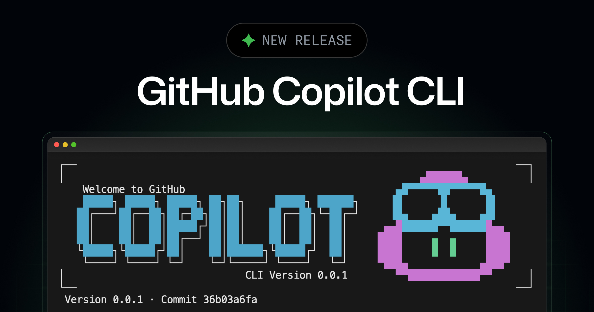

# Module 01 — Getting Started

**Estimated time:** 30–45 minutes

In this module, you will install GitHub Copilot CLI, authenticate it with your account, and run your first commands. By the end, you will have a working setup and a basic understanding of how the tool works.

---

## What Is GitHub Copilot CLI?



GitHub Copilot CLI is a command-line interface that brings GitHub Copilot into your terminal. Instead of relying only on editor completions, you can ask Copilot to explain commands, suggest shell scripts, and help with development tasks without leaving your terminal session.

It works as an extension to the GitHub CLI (`gh`) and communicates with GitHub's Copilot backend using your existing subscription.

---

## Step 1 — Install the GitHub CLI

Copilot CLI runs as a `gh` extension, so you need the GitHub CLI installed first.

**macOS:**
```bash
brew install gh
```

**Ubuntu / Debian:**
```bash
sudo apt install gh
```

**Windows:**
```powershell
winget install GitHub.cli
```

Verify the installation:
```bash
gh --version
```

You should see output like `gh version 2.x.x`.

---

## Step 2 — Authenticate with GitHub

Log in to your GitHub account using:
```bash
gh auth login
```

Follow the prompts. When asked which protocol to use, select **HTTPS**. When asked how to authenticate, select **Login with a web browser**, and complete the process in your browser.

To confirm you are logged in:
```bash
gh auth status
```

The output should show your username and that you are authenticated.

---

## Step 3 — Install the Copilot CLI Extension

```bash
gh extension install github/gh-copilot
```

After installation, confirm it is available:
```bash
gh copilot --help
```

You should see a list of available subcommands.

---

## Step 4 — Understanding the Two Main Commands

GitHub Copilot CLI has two primary commands:

### `gh copilot explain`

Use this to understand what a shell command does. This is especially useful when you encounter an unfamiliar command in documentation or a script.

```bash
gh copilot explain "tar -xzf archive.tar.gz"
```

Copilot will give you a plain-language explanation of the command and each flag.

Here is what that looks like in practice:


### `gh copilot suggest`

Use this when you know what you want to do but are not sure of the exact command.

```bash
gh copilot suggest "list all files larger than 100MB"
```

Copilot will suggest a command that does what you described.


---

## Step 5 — Interactive Mode

When you run `gh copilot suggest` without a specific request, it enters an interactive session where you can have a back-and-forth conversation.

```bash
gh copilot suggest
```

Think of it like asking a knowledgeable colleague a question. The more clearly you describe your situation, the more useful the answer will be.

You can describe your goal in natural language and ask follow-up questions. Type `exit` to leave the session.

---

## Seeing It in Action

Here is a short demo of Copilot CLI responding to a first prompt:


---

## Keeping Copilot CLI Updated

Run the following command periodically to stay on the latest version:
```bash
gh extension upgrade gh-copilot
```

---

## Exercises

Try the following on your own before moving to the next module.

**Exercise 1.1**
Install the GitHub CLI and Copilot extension, then run:
```bash
gh copilot --version
```
Note the version number. Take a screenshot — you will need this for your submission.

**Exercise 1.2**
Use `gh copilot explain` to understand this command:
```bash
gh copilot explain "ps aux | grep python"
```
Read the explanation. Does it match what you expected?

**Exercise 1.3**
Use `gh copilot suggest` to get a command for the following task:
```
Find all .log files in the current directory that were modified in the last 7 days
```
Run the suggested command in a test directory.

---

## Summary

In this module you:
- Installed the GitHub CLI and authenticated with your account
- Installed the GitHub Copilot CLI extension
- Ran your first `explain` and `suggest` commands
- Learned about interactive mode

Continue to [Module 02 — Core Commands and Context](../02-core-commands/README.md).
